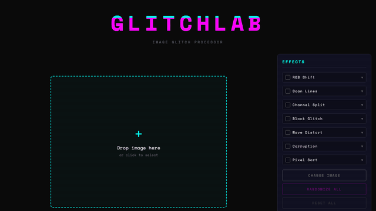
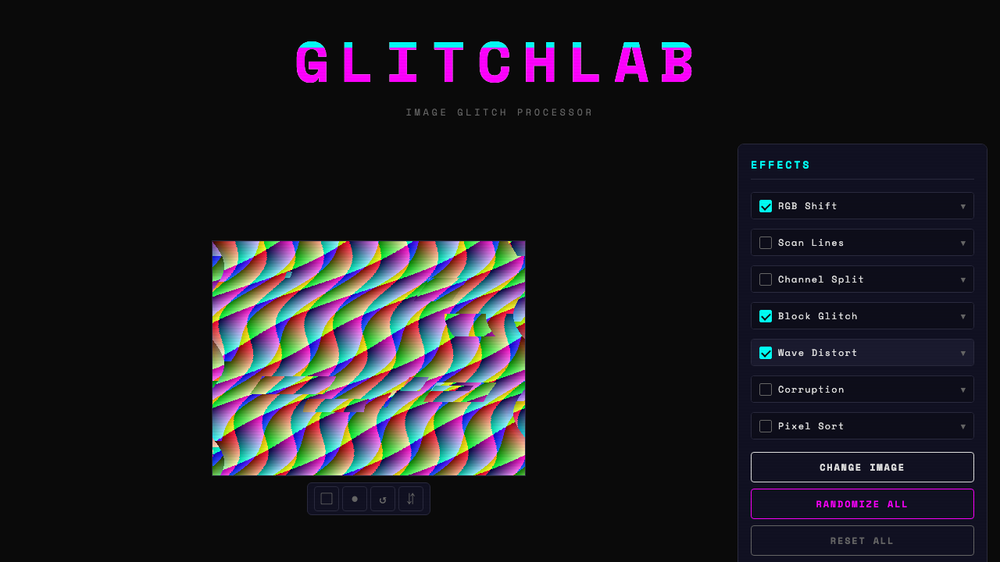
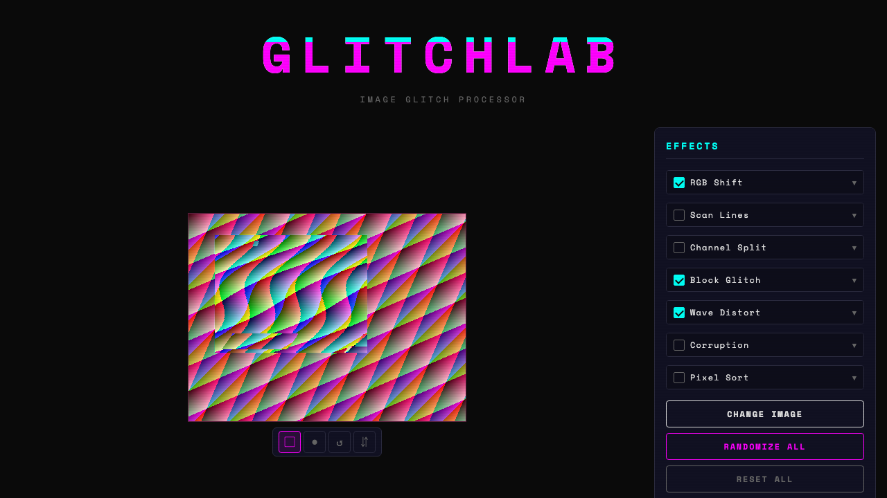
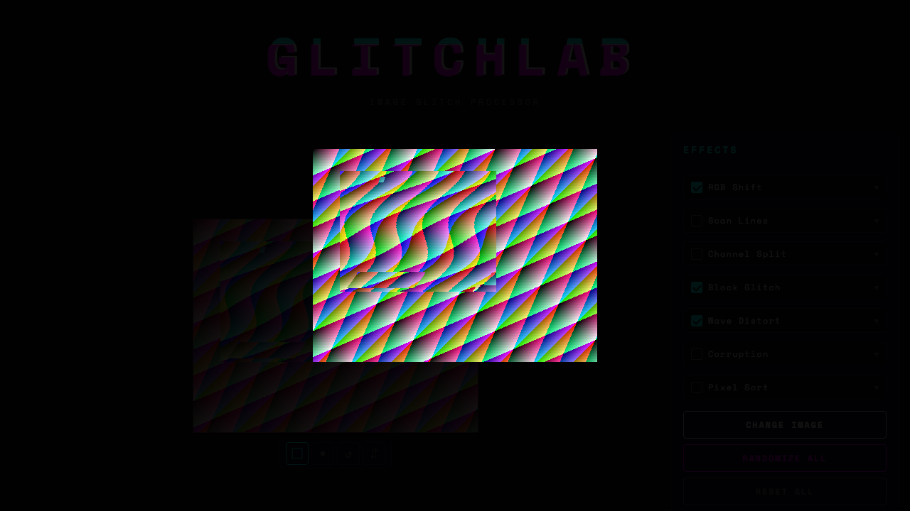

# GLITCHLAB

Image glitch effect processor. Apply digital distortion effects to any image — partially or fully — and copy the result to clipboard.

**Live demo**: https://glitchlab-aqn.pages.dev/



## Features

- **7 glitch effects**: RGB Shift, Scan Lines, Channel Split, Block Glitch, Wave Distort, Corruption, Pixel Sort
- **Partial masking**: Apply effects to selected regions only (rectangle or freehand brush selection)
- **Real-time preview**: Adjust parameters with instant visual feedback
- **Randomize**: Generate random effect combinations with one click
- **Copy output**: Copy as PNG (image) or SVG (text) to clipboard
- **Zoom**: Click the image to view full size in a modal
- **Privacy**: All processing happens in your browser. No images are uploaded or stored externally.

### Effects

|  |  |
|:---:|:---:|
| Multiple effects applied | Partial mask — effects only in selected region |

### Zoom

|  |
|:---:|
| Click the image to view full size |

## Usage

1. Drop an image onto the page (or click to select)
2. Enable effects and adjust parameters in the right panel
3. Optionally use selection tools to limit effects to a region
4. Copy the result with COPY PNG or COPY SVG

## Development

```bash
npx serve .
```

No build step required — pure vanilla JS with ES modules.

## Deploy

```bash
npx wrangler pages deploy . --project-name glitchlab
```

## Tech

- Vanilla JavaScript (ES modules, no framework)
- Canvas 2D API for pixel manipulation
- Clipboard API for copy
- Pointer Events for touch support
- Cloudflare Pages for hosting
